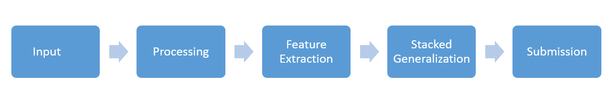

# Kaggle_HomeDepot

110th Place Solution for [Home Depot Product Search Relevance][kaggle_home]

### Dependencies
- `scikit-learn`
- `pandas`
- `numpy`
- `pychant`
- `keras`
- `xgboost`

### FlowChart


### Configuration
The configuration of the project can be changed from `configs.py`.

Note: Use `python3` as default interpreter.

### Regenerating Results
Before running any of the files copy the data to `input/` folder. So, the project structure should look like

```
Kaggle_HomeDepot
└───input
    │   train.csv
    │   test.csv
    │   sample_submission.csv
└───scripts
    │   README.md
    │   ...
```

Now, To regenerate the results run these files mentioned below respectively.

#### Data Pre-Processing and Feature Extraction

- `feature_generater.py` - Clean Data and generates TF-IDF features
- `features_distance.py` - Generates distance and counting features
- `generate_dataset_svd50x3_distance.py` - Combine all the individual features and generates a dataset.

#### Machine Learning and Stacked Generalization

- `StackedGeneralization.py` - To train all the machine learning modules and stacks all the results to create the submission.

[//]: # (These are reference links used in the body of this note and get stripped out when the markdown processor does its job. There is no need to format nicely because it shouldn't be seen. Thanks SO - http://stackoverflow.com/questions/4823468/store-comments-in-markdown-syntax)


   [kaggle_home]: <https://www.kaggle.com/c/home-depot-product-search-relevance>
